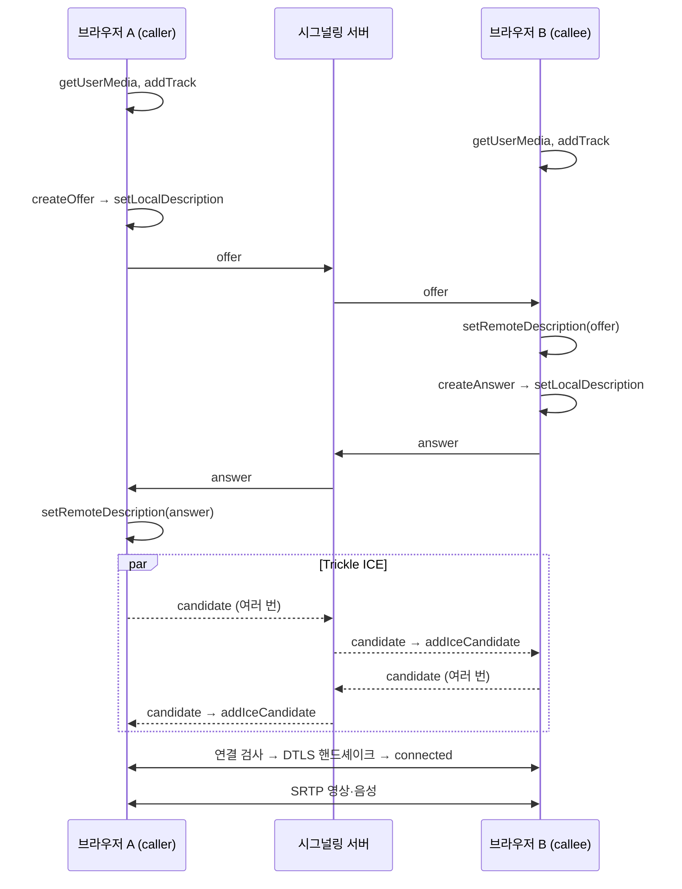

# 01. WebRTC 핵심 개념

## 1. WebRTC 란

브라우저끼리 플러그인 없이 **실시간 영상·음성·데이터를 직접 주고받는** 표준 API 입니다.
미디어 전송은 P2P 이지만, 서로를 찾고 조건을 맞추는 과정(시그널링)에는 별도의 서버가 필요합니다.

```
 브라우저 A ◄── 시그널링(WebSocket 서버) ──► 브라우저 B      ← 연결 "설정" 정보만
 브라우저 A ◄════════ 영상·음성 (SRTP, P2P) ════════► 브라우저 B ← 실제 미디어
```

## 2. 구성 요소

### 2.1 MediaStream / MediaStreamTrack

- `getUserMedia({ video: true, audio: true })` 로 카메라·마이크를 얻으면 `MediaStream` 이 반환됩니다.
- 스트림은 여러 개의 **트랙**(`video`, `audio`)으로 구성됩니다.
- `<video>.srcObject = stream` 으로 화면에 표시합니다.
- 내 영상 `<video>` 에는 반드시 `muted` 를 줍니다 (내 소리가 다시 나와 하울링 발생 방지).
- 트랙 제어
  - `track.enabled = false` → 음소거/화면 끄기 (연결은 유지)
  - `track.stop()` → 장치 해제 (카메라 표시등 꺼짐)

### 2.2 RTCPeerConnection

두 피어 간 연결 하나를 나타내는 객체입니다.

```js
const pc = new RTCPeerConnection({
  iceServers: [{ urls: 'stun:stun.l.google.com:19302' }],
  iceTransportPolicy: 'all',          // 'relay' 이면 TURN 후보만 사용
});
stream.getTracks().forEach((t) => pc.addTrack(t, stream));
pc.ontrack = (e) => (remoteVideo.srcObject = e.streams[0]);
```

| 이벤트 / 속성 | 의미 |
|---|---|
| `onicecandidate` | 내 ICE 후보가 하나 수집됨 → 상대에게 보내야 함. `candidate == null` 이면 수집 완료 |
| `onicecandidateerror` | STUN/TURN 서버와의 통신 실패 (701, 401 등) |
| `ontrack` | 상대의 트랙이 도착함 → 원격 `<video>` 에 연결 |
| `connectionState` | `new → connecting → connected` / `disconnected` / `failed` / `closed` |
| `iceConnectionState` | ICE 계층의 상태 (`checking → connected`) |
| `getStats()` | 선택된 후보 쌍, 수신 바이트·프레임 등 통계 |

### 2.3 SDP (Session Description Protocol)

"나는 이런 미디어를 이런 코덱으로 주고받을 수 있다"는 **텍스트 명세**입니다.

```
v=0
m=audio 9 UDP/TLS/RTP/SAVPF 111 63 9 0 8 ...     ← 오디오 미디어 섹션
a=rtpmap:111 opus/48000/2
m=video 9 UDP/TLS/RTP/SAVPF 96 97 98 ...         ← 비디오 미디어 섹션
a=rtpmap:96 VP8/90000
a=sendrecv                                        ← 방향 (sendrecv / sendonly / recvonly)
a=fingerprint:sha-256 ...                         ← DTLS 인증서 지문 (암호화)
```

- **Offer**: 먼저 제안하는 쪽(caller)이 `createOffer()` 로 생성
- **Answer**: 받은 쪽(callee)이 `createAnswer()` 로 응답
- 각자 `setLocalDescription`(내 것), `setRemoteDescription`(상대 것)을 호출해야 협상이 끝납니다.
- 이 예제의 loopback 단계에서 offer 는 약 215줄, answer 는 약 206줄이었습니다 (DevTools 콘솔에 전체 출력).

### 2.4 ICE (Interactive Connectivity Establishment)

두 피어 사이에 **실제로 통하는 네트워크 경로**를 찾는 절차입니다.

1. 각자 가능한 주소 후보(candidate)를 수집합니다.
2. 시그널링으로 후보를 교환합니다 (**Trickle ICE**: 하나 생길 때마다 바로 전송).
3. 후보를 짝지어 연결 검사(STUN binding)를 하고, 성공한 쌍 중 우선순위가 높은 것을 선택합니다.

| 후보 타입 | 얻는 방법 | 의미 | 우선순위 |
|---|---|---|---|
| `host` | 내 네트워크 인터페이스 | 로컬(사설) 주소. 같은 LAN 에서만 유효 | 높음 |
| `srflx` (server reflexive) | STUN 서버 | NAT 바깥에서 보이는 공인 IP:포트 | 중간 |
| `prflx` (peer reflexive) | 연결 검사 중 | 상대의 검사 패킷에서 새로 알게 된 주소 | 중간 |
| `relay` | TURN 서버 | TURN 서버가 할당한 중계 주소 | 낮음 (최후 수단) |

> 브라우저는 사설 IP 노출을 막기 위해 host 후보 주소를 `xxxxxxxx-....local` 형태의 **mDNS 이름**으로 가립니다.
> 같은 LAN 에서는 이 이름이 해석되어 연결되고, 다른 네트워크에서는 해석되지 않습니다.

## 3. 연결 순서 (Offer/Answer + Trickle ICE)



### 순서 규칙 (중요)

1. **`addTrack` 은 `createOffer`/`createAnswer` 전에** 호출합니다. 늦으면 영상이 협상에 포함되지 않습니다 (재협상 필요).
2. `setLocalDescription` 을 호출하는 순간부터 ICE 후보 수집이 시작됩니다.
3. **`remoteDescription` 이 없는 상태에서 `addIceCandidate` 하면 실패**합니다.
   → 먼저 도착한 후보는 큐에 보관했다가 `setRemoteDescription` 직후 처리합니다 (이 예제의 `pendingCandidates`).
4. 받는 쪽(callee)도 offer 를 받기 전에 PeerConnection 과 트랙이 준비돼 있어야 answer 에 내 영상이 포함됩니다.

## 4. Loopback (단계 2)

한 페이지 안에 `pc1`(송신), `pc2`(수신)를 만들고, 네트워크 대신 **함수 호출로 직접** SDP 와 후보를 넘깁니다.

```js
const offer = await pc1.createOffer();
await pc1.setLocalDescription(offer);
await pc2.setRemoteDescription(offer);
const answer = await pc2.createAnswer();
await pc2.setLocalDescription(answer);
await pc1.setRemoteDescription(answer);
pc1.onicecandidate = (e) => e.candidate && pc2.addIceCandidate(e.candidate);
pc2.onicecandidate = (e) => e.candidate && pc1.addIceCandidate(e.candidate);
```

시그널링 서버 없이 협상 흐름만 먼저 익힐 수 있습니다.
단계 4 는 이 "직접 호출"을 WebSocket 메시지 송수신으로 바꾼 것입니다.

## 5. 보안

- WebRTC 미디어는 항상 **DTLS-SRTP 로 암호화**됩니다 (끌 수 없음). TURN 서버도 내용을 볼 수 없습니다.
- `getUserMedia` 는 **secure context**(`https://` 또는 `http://localhost`)에서만 동작합니다 → [04-network-access.md](04-network-access.md)
