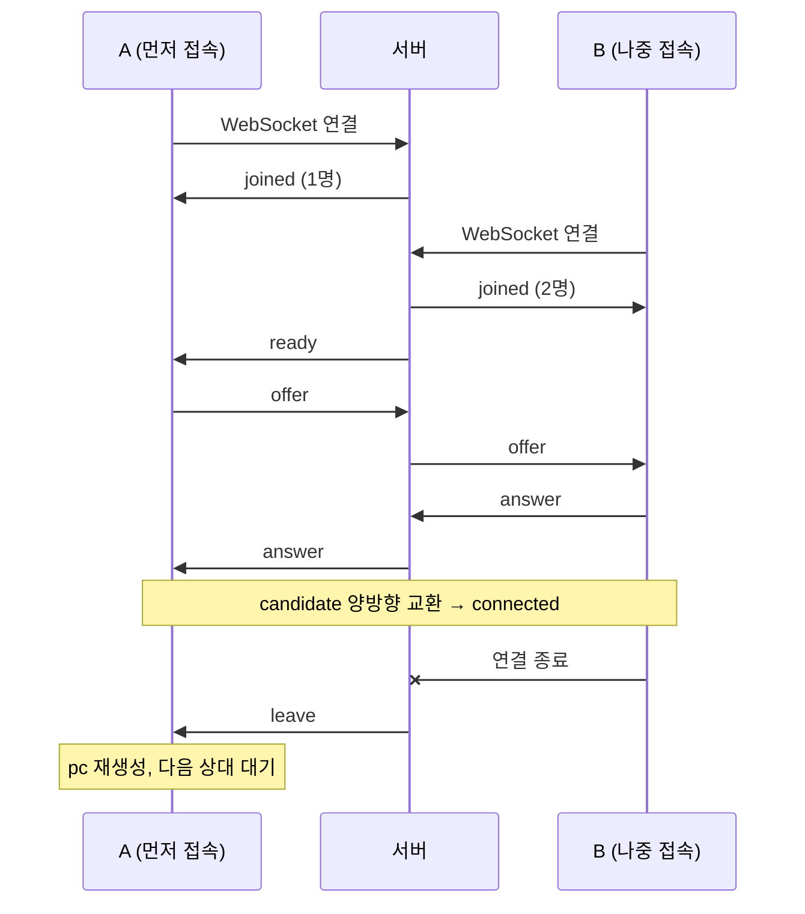

# 02. 프로젝트 구조와 동작

## 1. 전체 구조

```
 ┌───────────┐   HTTP: 페이지, /ice-config    ┌────────────────────────┐
 │ Browser A │◄──────────────────────────────►│ Node.js (server.js)     │
 │           │   WebSocket: offer/answer/ICE  │  - Express 정적 서빙      │
 └─────┬─────┘◄──────────────────────────────►│  - ws 시그널링 (최대 2명) │
       │                                      │  - ICE 서버 설정 발급      │
       │                                      └────────────────────────┘
       │        ┌────────────────┐                       ▲
       │        │ coturn (Docker) │  STUN/TURN            │ 동일
       ├───────►│ 3478, 49160-200 │◄──────────────┐       │
       │        └────────────────┘                │ ┌─────┴─────┐
       └════════════ 영상·음성 (P2P 또는 TURN 경유) ═══►│ Browser B │
                                                    └───────────┘
```

## 2. 파일 구성

```
영상/
├─ server.js             # Express + WebSocket 시그널링 + /ice-config
├─ package.json          # npm start (.env 자동 로드), npm run turn
├─ .env.example          # STUN/TURN 설정 예시 (.env 로 복사해 사용, git 제외)
├─ turn/
│  ├─ turnserver.conf    # coturn 설정 (static-auth-secret, 릴레이 포트 범위)
│  └─ run-coturn.ps1     # coturn Docker 실행 스크립트 (PC IP 자동 감지)
├─ public/
│  ├─ index.html         # 1:1 통화 화면
│  ├─ main.js            # 통화 로직 (시그널링, PeerConnection, 상태 표시)
│  ├─ loopback.html/js   # 단계 2: 한 페이지 loopback
│  ├─ ice-test.html/js   # STUN/TURN 후보 수집 테스트
│  └─ style.css          # 공통 스타일
└─ DOC/                  # 이 문서
```

## 3. 서버 (`server.js`)

### 3.1 역할

| 기능 | 설명 |
|---|---|
| 정적 서빙 | `public/` 폴더 |
| 시그널링 | WebSocket. 메시지 내용을 해석하지 않고 **상대에게 그대로 전달** |
| 방 관리 | 접속자 최대 2명. 세 번째 접속은 `full` 응답 후 종료 |
| 역할 결정 | 두 번째 사람이 들어오면 **먼저 있던 사람에게 `ready`** → 그쪽이 offer 생성(caller) |
| ICE 설정 | `GET /ice-config` → `{ iceServers: [...] }` (`.env` 기반, TURN 임시 자격증명 포함) |

### 3.2 시그널링 메시지

모든 메시지는 JSON 문자열입니다.

| 방향 | `type` | 내용 | 수신 측 동작 |
|---|---|---|---|
| 서버 → 클라 | `joined` | `count`: 현재 인원 | 로그 표시 |
| 서버 → 클라 | `ready` | - | caller 가 되어 offer 생성·전송 |
| 서버 → 클라 | `full` | - | 접속 종료 (방이 가득 참) |
| 서버 → 클라 | `leave` | - | 상대가 나감 → PeerConnection 재생성 후 대기 |
| 클라 ↔ 클라 | `offer` | `sdp` | `setRemoteDescription` → answer 생성·전송 |
| 클라 ↔ 클라 | `answer` | `sdp` | `setRemoteDescription` |
| 클라 ↔ 클라 | `candidate` | `candidate` | `addIceCandidate` (remoteDescription 전이면 큐에 보관) |

### 3.3 접속 시나리오



## 4. 클라이언트 (`public/main.js`)

### 4.1 주요 함수

| 함수 | 역할 |
|---|---|
| `startCamera()` | `getUserMedia`. 실패 원인별 안내. 실패해도 **수신 전용(nocam)** 접속 가능 |
| `loadIceConfig()` | `/ice-config` 조회 → `rtcConfig` 구성. relay 강제인데 TURN 이 없으면 접속 차단 |
| `join()` | ICE 설정 로드 → WebSocket 연결 → `createPc()` |
| `createPc()` | PeerConnection 생성, 트랙 추가(또는 `recvonly` transceiver), 이벤트 연결 |
| `onSignal(msg)` | 시그널링 메시지 처리 (`ready/offer/answer/candidate/leave/full`) |
| `addCandidate()` / `flushCandidates()` | remoteDescription 이전 후보 큐 처리 |
| `showSelectedPair()` | `getStats()` 로 선택된 후보 쌍과 영상 경로 표시 |
| `resetPeer()` | 상대가 나갔을 때 pc 재생성 (TURN 자격증명도 다시 받음) |
| `hangup()` | pc·WebSocket 종료, 트랙 `stop()`, 화면 초기화 |

### 4.2 UI 상태

```
init ──카메라 켜기──► camera ──접속──► waiting ──connected──► connected
  │                                       ▲                       │
  └──카메라 실패──► nocam ──접속──────────┘◄──── 상대 leave ──────┘
                         (nocam / waiting / connected 에서 [종료] → init)
```

| 상태 | 카메라 켜기 | 접속 | 음소거 | 종료 | relay 체크 |
|---|---|---|---|---|---|
| init | ● | | | | ● |
| camera | | ● | | | ● |
| nocam | ● (재시도) | ● | | ● | ● |
| waiting | | | | ● | |
| connected | | | ● (카메라 있을 때) | ● | |

> `iceTransportPolicy` 는 PeerConnection 생성 시점에만 적용되므로, 접속 중에는 relay 체크박스를 잠급니다.

### 4.3 영상 경로 판정 (`showSelectedPair`)

| 선택된 후보 쌍 | 표시 |
|---|---|
| 어느 한쪽이라도 `relay` | TURN 서버 경유 |
| 어느 한쪽이라도 `srflx` | P2P (STUN 공인 주소) |
| 그 외 (`host`, `prflx`) | P2P 직접 |

## 5. 화면 구성

### 5.1 1:1 통화 (`index.html`)

```
┌───────────────────────────────────────────────────────┐
│ WebRTC 맛보기 · 1:1 통화                ● 시그널링: 연결됨 │
├───────────────────────────────────────────────────────┤
│ ┌───────────────────────────────────────────────────┐ │
│ │               상대방 영상 (#remote)                 │ │
│ │                                   ┌─────────────┐ │ │
│ │                                   │ 내 영상(PIP)  │ │ │
│ │                                   └─────────────┘ │ │
│ └───────────────────────────────────────────────────┘ │
│ [카메라 켜기] [접속] [🎤 음소거] [📞 종료] ☐ TURN만 사용   │
│ ⚠ 오류 안내 (#error, 필요할 때만)                         │
│ 연결 상태 · ICE(후보 쌍·경로) · 역할                       │
│ 내 후보(host/srflx/relay 개수) · ICE 서버 목록             │
│ ▾ 로그                                                  │
└───────────────────────────────────────────────────────┘
```

### 5.2 ICE 테스트 (`ice-test.html`)

- `/ice-config` 값을 JSON 으로 보여주고 직접 수정해 시험할 수 있습니다.
- 데이터 채널 하나로 offer 를 만들어 **미디어·상대 없이** 후보 수집만 수행합니다 (최대 10초).
- 수집된 후보 표(타입, 프로토콜, 주소, 관련 주소, 서버 URL, 시간)와 판정 결과, 오류 코드를 표시합니다.

## 6. 설정 (`.env`)

| 변수 | 기본값 | 설명 |
|---|---|---|
| `PORT` | `3000` | 서버 포트 |
| `STUN_URLS` | `stun:stun.l.google.com:19302` | 쉼표 구분. **빈 값이면 STUN 끔** |
| `TURN_URLS` | (없음) | 예: `turn:192.168.x.x:3478?transport=udp,turn:192.168.x.x:3478?transport=tcp` |
| `TURN_SECRET` | (없음) | coturn `static-auth-secret` 과 같은 값 → 시간제한 자격증명 발급 |
| `TURN_TTL` | `3600` | 임시 자격증명 유효 시간(초) |
| `TURN_USER` / `TURN_PASS` | (없음) | `TURN_SECRET` 이 없을 때 쓰는 고정 계정 (관리형 TURN 등) |

`npm start` 는 `node --env-file-if-exists=.env server.js` 로 실행되어 `.env` 를 자동으로 읽습니다.
