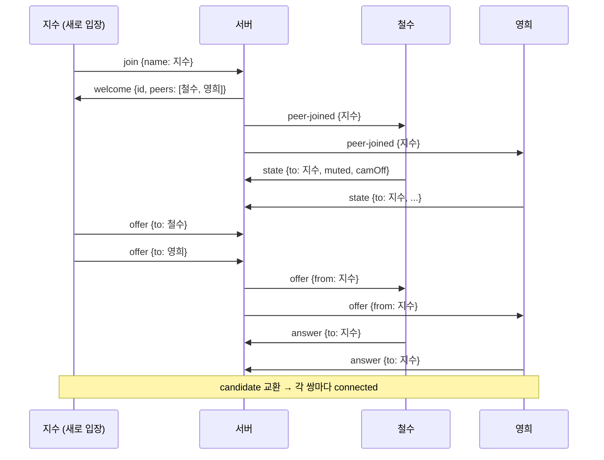

# 08. 그룹 영상통화 (최대 4명, Mesh)

`index.html` 은 최대 4명이 함께 쓰는 그룹 통화입니다. 기존 1:1 통화는 `call-1to1.html` 로 옮겨 그대로 동작합니다.

## 1. 구조: Mesh

```
        철수 ─────── 영희
         │ ╲       ╱ │
         │   ╲   ╱   │        참가자마다 나머지 전원과 RTCPeerConnection 을 하나씩 맺는다
         │     ╳     │        4명 → 연결 6개 (각자 3개)
         │   ╱   ╲   │
        민수 ─────── 지수
```

| 항목 | 1:1 | 그룹 (Mesh) |
|---|---|---|
| 내 PeerConnection 개수 | 1 | 참가자 수 − 1 (최대 3) |
| 내 업로드량 | 영상 1개 | 영상 × (참가자 − 1) → 4명이면 약 3배 |
| 서버 역할 | 메시지 전달 | 메시지 전달 + 참가자 ID 관리 (영상은 여전히 서버를 거치지 않음) |

업로드량을 줄이기 위해 그룹 통화는 송출 해상도를 **640×360, 24fps** 로 요청합니다 (`group.js` 의 `MEDIA`).
더 많은 인원(5명 이상)은 Mesh 로는 업로드가 감당이 안 되므로 SFU(mediasoup, LiveKit 등)를 사용합니다.

## 2. 시그널링 (`/group` 경로)

서버는 WebSocket 경로로 1:1 과 그룹을 구분합니다.

| 경로 | 페이지 | 처리 |
|---|---|---|
| `/` | `call-1to1.html` | 기존 1:1 (`onConnection`, 최대 2명) |
| `/group` | `index.html` | 그룹 (`onGroupConnection`, 최대 4명) |

### 2.1 메시지

| 방향 | `type` | 내용 |
|---|---|---|
| 클라 → 서버 | `join` | `name` |
| 서버 → 클라 | `welcome` | `id`(내 ID), `name`, `peers: [{id, name}]`(기존 참가자), `max` |
| 서버 → 기존 참가자 | `peer-joined` | `id`, `name` |
| 서버 → 남은 참가자 | `peer-left` | `id` |
| 서버 → 클라 | `full` | `max` (정원 초과, 연결 종료) |
| 클라 ↔ 클라 | `offer` / `answer` / `candidate` | `to`: 받을 사람 ID. 서버가 `from` 을 붙여 **그 사람에게만** 전달 |
| 클라 ↔ 클라 | `state` | `muted`, `camOff`, `noCam`, `noMic`. `to` 가 없으면 전원에게 |

- 서버는 `offer/answer/candidate/state` 외의 메시지는 전달하지 않고, 형식이 잘못된 JSON 은 무시합니다.
- 이름은 서버에서 20자로 자르고, 화면에는 `textContent` 로만 넣습니다 (HTML 삽입 방지).

### 2.2 누가 offer 를 보내나 — 새로 들어온 사람



새로 들어온 사람만 offer 를 보내고 기존 참가자는 answer 만 하므로,
**양쪽이 동시에 offer 를 보내는 충돌(glare)** 이 생기지 않습니다.

### 2.3 메시지 처리 순서 (직렬화)

- `welcome` 처리 중에는 기존 참가자마다 `createOffer` 를 `await` 합니다.
- 그 사이에 도착한 `state`/`candidate` 가 아직 만들어지지 않은 참가자 앞으로 와서 **버려지는 문제**가 있었습니다
  (실험: 영희가 카메라를 끈 뒤 들어온 민수 화면에 영희가 카메라 켜진 상태로 표시됨).
- 해결
  1. 시그널링 메시지를 Promise 체인으로 **도착 순서대로 하나씩** 처리
  2. `welcome` 에서 참가자 객체를 **먼저 모두 만든 뒤** offer 전송

## 3. 화면

### 3.1 전체 구성

```
┌──────────────────────────────────────────────────────────────┐
│ 그룹 영상통화 최대 4명               참가자 3/4  ● 시그널링: 연결됨 │
│ 이름 [ 철수 ______ ]                                  (접속 중 잠김) │
├──────────────────────────────────────────────────────────────┤
│                영상 그리드 (인원수에 따라 자동 배치)                 │
├──────────────────────────────────────────────────────────────┤
│ [카메라 켜기] [접속] [🎤 음소거] [📷 카메라 끄기] [📞 나가기]  ☐ TURN만 │
│ ⚠ 오류 안내                                                    │
│ 연결 상태 표: 이름 | 상태 | ICE 경로 | 내 후보                       │
│ ICE 서버 목록 · ▸ 로그                                          │
└──────────────────────────────────────────────────────────────┘
```

### 3.2 인원수별 배치 (`#grid[data-count]`)

| 인원 | 배치 | CSS |
|---|---|---|
| 1 | 1칸 (대기 안내 표시) | `grid-template-columns: 1fr` |
| 2 | 나란히 1×2 (폰은 세로 1열) | `repeat(2, 1fr)` |
| 3 | 위 2칸, 아래 1칸 가운데 | 4열 그리드에서 각 타일 `span 2`, 3번째는 `2 / span 2` |
| 4 | 2×2 | `repeat(2, 1fr)` |

순서는 항상 **나(첫 칸) → 들어온 순서**입니다. 내 영상은 거울 모드로 표시합니다.

### 3.3 타일

| 요소 | 내용 |
|---|---|
| 영상 | `object-fit: cover`, 16:9 |
| 이름표 (좌하단) | 이름, 음소거 시 🔇 |
| 배지 (우상단) | 연결 상태 색(연결 중 노랑 / 연결됨 초록 / 끊김 주황 / 실패 빨강) + 경로(P2P / STUN / TURN) |
| 이니셜 아이콘 | 카메라 끔·카메라 없음(수신 전용)일 때 영상 대신 표시. 영상만 숨기므로 **소리는 계속 재생** |
| 안내 문구 | 연결 중… / 연결 끊김 (복구 중) / 연결 실패 |

### 3.4 크게 보기 (스포트라이트)

- 타일을 **클릭**(또는 포커스 후 Enter/Space)하면 그 타일이 맨 위 전체 폭으로 커지고, 나머지는 아래 줄에 작게 배치됩니다.
- 같은 타일을 다시 클릭하거나 **Esc** 를 누르면 원래 배치로 돌아갑니다.
- 크게 보던 참가자가 나가면 자동으로 해제됩니다.

## 4. 버튼과 동작

| 버튼 | 동작 |
|---|---|
| 카메라 켜기 | `getUserMedia(640×360)`. 실패하면 수신 전용(nocam)으로 접속 가능 |
| 접속 | 이름 필수 → ICE 설정 로드 → `/group` 접속 → `join` |
| 🎤 음소거 | 오디오 트랙 `enabled` 토글 + `state` 전송 → 상대 타일에 🔇 |
| 📷 카메라 끄기 | 비디오 트랙 `enabled` 토글 + `state` 전송 → 상대 타일에 이니셜 아이콘 (연결은 유지) |
| 📞 나가기 | 모든 PeerConnection·WebSocket 종료, 카메라 해제. 나머지 사람들의 통화는 계속됨 |

- 이름은 브라우저(`localStorage`)에 저장해 다음 접속 때 자동으로 채웁니다. 같은 브라우저의 탭끼리는 공유되므로, 한 PC 에서 여러 탭으로 시험할 때는 이름을 바꿔 주세요.
- 상대 한 명이 나가면 그 타일과 표의 행만 사라지고 나머지 연결은 유지됩니다.

## 5. 검증 결과

검증 환경에서는 탭마다 `getUserMedia` 를 이름이 적힌 canvas 영상 + 오실레이터 음으로 대체했습니다.

| 항목 | 결과 |
|---|---|
| 4명 입장 | 각 탭에서 나머지 3명과 `connected`, 모든 타일 640×360 재생, 배지 `● P2P` |
| 5번째 입장 | "방이 가득 찼습니다 (최대 4명)" 안내, 연결 종료, 다시 접속 버튼 활성 |
| 음소거·카메라 끄기 | 다른 참가자 타일에 🔇, 이니셜 아이콘 표시 |
| 상태 전달 (나중 입장자) | 영희가 카메라를 끈 뒤 들어온 민수·지수 화면에도 이니셜·🔇 표시 (직렬화 수정 후) |
| 1명 퇴장 | 남은 3명 화면이 3인 배치로 바뀜, 표에서 행 제거 |
| 재입장 | 다시 4명 연결 |
| 크게 보기 | 클릭 → 확대, 재클릭·Esc → 해제 |
| 1:1 통화 (`call-1to1.html`) | 같은 서버에서 정상 연결 (`/` 경로) |
| 서버 로그 | `[group] 입장/퇴장/접속 거부` 기록 |

미검증: 실제 카메라 4대, 외부망에서 4명 연결, 4명일 때 업로드 대역폭·화질.
